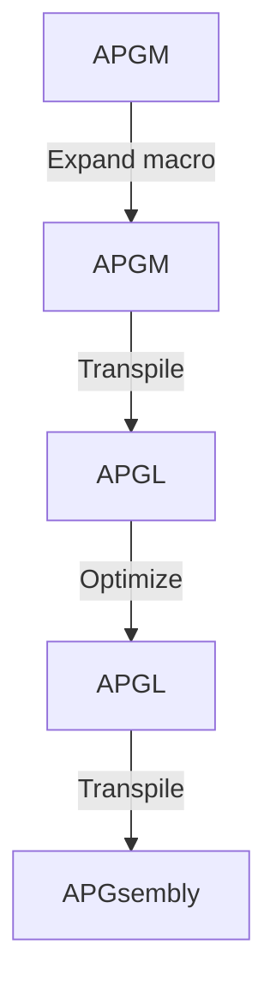

# APGM

APGsembly macro language

## Pipeline

## Testing

### Requirements

- `make`
- `deno`
  - https://deno.land/#installation
  - `file_server`
    - https://deno.land/manual@v1.15.3/examples/file_server
- `npm`
  - Run `$ npm install`

### Usage

- `$ make up` Local server
  - access to `http://localhost:1618/`
- `$ make t` Unit tests
- `$ make w` Unit tests with file watcher
- `$ make fmt` Formatting
- `$ make bundle` Bundling
