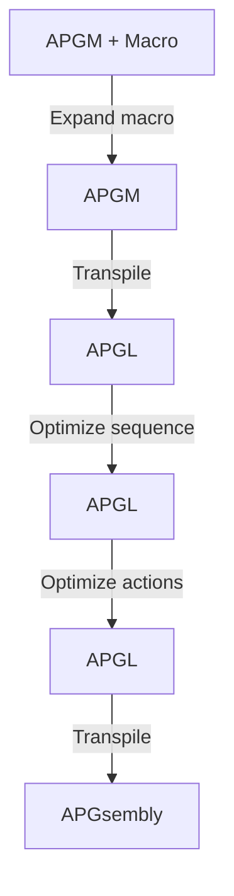

# APGM

APGsembly macro language

## Pipeline

## Testing

### Requirements

- `deno` above 1.24.0
  - https://deno.land/#installation

### Usage

- `$ deno task up` Local server
  - access to [http://localhost:1618/](http://localhost:1618/)
- `$ deno task t` Unit tests
- `$ deno task w` Unit tests with file watcher
- `$ deno task fmt` Formatting
- `$ deno task bundle` Bundling

## Coverage

### Requirements

- `deno`
- `lcov`
  - https://formulae.brew.sh/formula/lcov

### Usage

- `$ deno task cov` open lcov page
